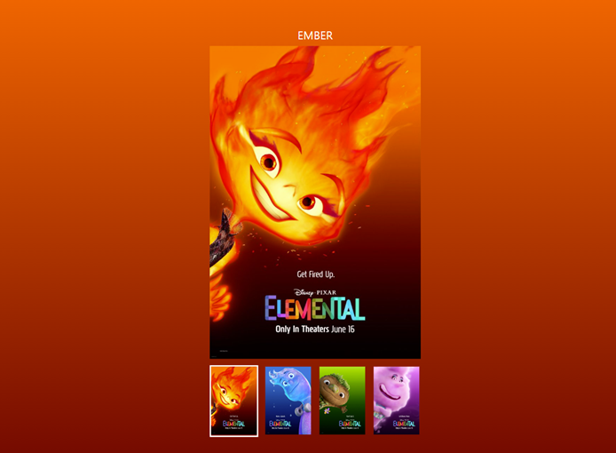
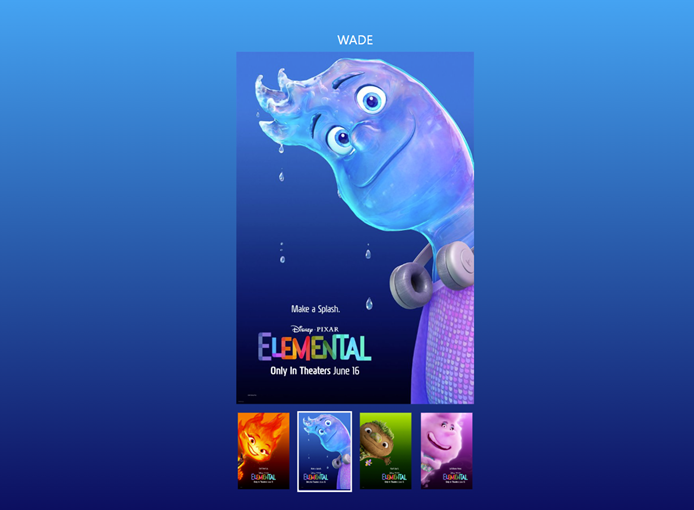
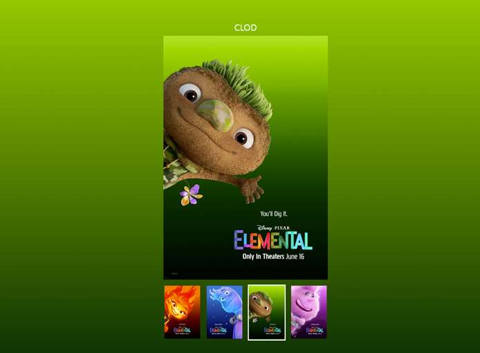
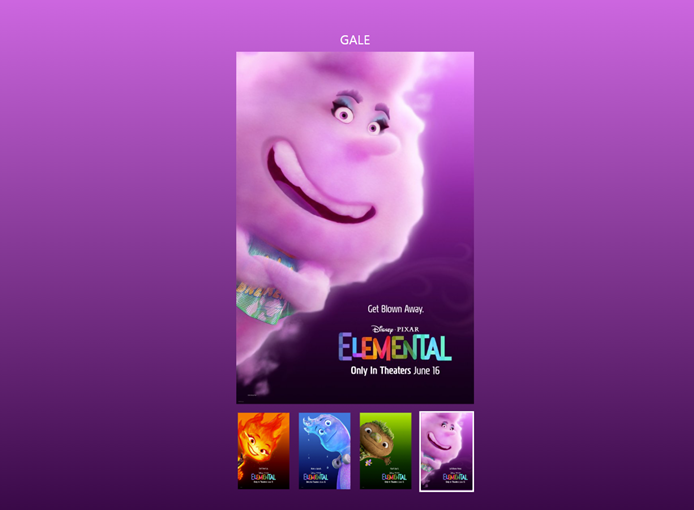

# 자바스크립트 엘리멘탈 슬라이드 과제 (~7/23)
### 1. 완성 페이지
- 하단 작은 이미지(리스트) 4개를 각각 누른다.
- **큰 중간 이미지**, **상단 캐릭터 이름**, **해당오디오**,**배경이미지 색상**이 누른 리스트에 따라 변경된다.
#####  page.1
  

##### page.2
  

##### page.3
  

#####  page.4
  


<br />

### 2. Javascript
---
##### 선택자 요소 가져오기
  + 유틸함수 ```getNode()```로 선택자요소 불러오기
```js
const navigation = getNode(".nav");
const visualImage = getNode(".visual img");
const body = getNode("body");
const ul = getNode("ul");
const nickName = getNode(".nickName");
```
##### audio.js의 AudioPlayer class 요소 가져오기
```js
let audioPlayer = new AudioPlayer(`./assets/audio/ember.m4a`);
```
### 함수 요소
---

##### 1. `setBgColor` 함수
-  리스트 선택할때마다 배경색 변경 ( colorB의 기본값은 `#000` 으로 한다 )
-  
```js
//!. `setBgColor` 함수
function setBgColor(node, colorA, colorB = "#000") {
  if (typeof node === "string") node = getNode(node);

  node.style.background = `linear-gradient(to bottom, ${colorA}, ${colorB})`;
}
```
##### 2. `setImage` 함수
```js
//!. `setImage` 함수
function setImage(node, prop, value) {
  if (typeof node === "string") {
    node = getNode(node);
  }

  // 전달받은 prop의 타입이 string이 아니라면 Error!
  if (typeof prop !== "string") {
    throw new TypeError(
      "setImage 함수의 두 번째 인수는 문자 타입 이어야 합니다."
    );
  }
  node.setAttribute(prop, value);
}

```

##### 3. `setNameText`  함수
```js
//!setNameText 함수
function setNameText(node, value) {
  node.textContent = value;
}
```
##### 4. 음성 플레이 `handleAudio` 함수
```js
//! 음성 플레이
function handleAudio(value) {
  audioPlayer = new AudioPlayer(value);
  audioPlayer.play();
}
```
<br/>

### `handleSlider`  함수
navigattion 클릭하면 handleSlider 실행
- 이미지와 색상의 데이터는 `data.js` 에서 불러옴
- 각 li 항목들을 클릭하면 배경 색상과 메인 비주얼 이미지를 변경 
```js
//! navigattion 클릭하면 handleSlider 실행
function handleSlider(e) {
  e.preventDefault();
  // 1. 이벤트 위임
  const target = e.target.closest("li");

  if (!target) return;

  const list = [...ul.children];
  const index = attr(target, "data-index");
  // 2. 반복문 사용
  list.forEach((li) => removeClass(li, "is-active"));

  addClass(target, "is-active");
```
- 위에 설정한 함수 불러오기
```js
  //? 1. 배경색 변경 ( colorB의 기본값은 `#000`)
  setBgColor(body, data[index - 1].color[0], data[index - 1].color[1]);
  //? 2. 이미지 변경
  setImage(visualImage, "src", `./assets/${data[index - 1].name}.jpeg`);
  setImage(visualImage, "alt", data[index - 1].alt);
  //? 3. 비주얼이 변경되면 상단에 비주얼에 맞는 이름으로 변경해주세요.
  setNameText(nickName, data[index - 1].name);
  //? 4.오디오 변경
  handleAudio(`./assets/audio/${data[index - 1].name}.m4a`);
}

```
#### naviagation에 클릭 이벤트
```js
//* naviagation에 클릭 이벤트
navigation.addEventListener("click", handleSlider);
```


<br />

### 3. 어려웠던 점
---

- audio.js의 `AudioPlayer` class 요소 가져올때 new (class 이름)으로 생성자 함수로 가져오기
```js
let audioPlayer = new AudioPlayer(`./assets/audio/ember.m4a`);
```

- 만약 함수 인자 node에 string이 들어오면 node 선택자를 다시 불러오기
```js
  if (typeof node === "string") {
    node = getNode(node);
  }
```
- 함수안에 value 넣을때 `벡틱과 ${} 사용하기
```js
node.style.background = `linear-gradient(to bottom, ${colorA}, ${colorB})`;
```


- target의 가장 가까운 li 찾기
```js
const target = e.target.closest("li");
```
- list를 각각 forEach로 is-active 지우기
```js
  const list = [...ul.children];

  list.forEach((li) => removeClass(li, "is-active"));
```


